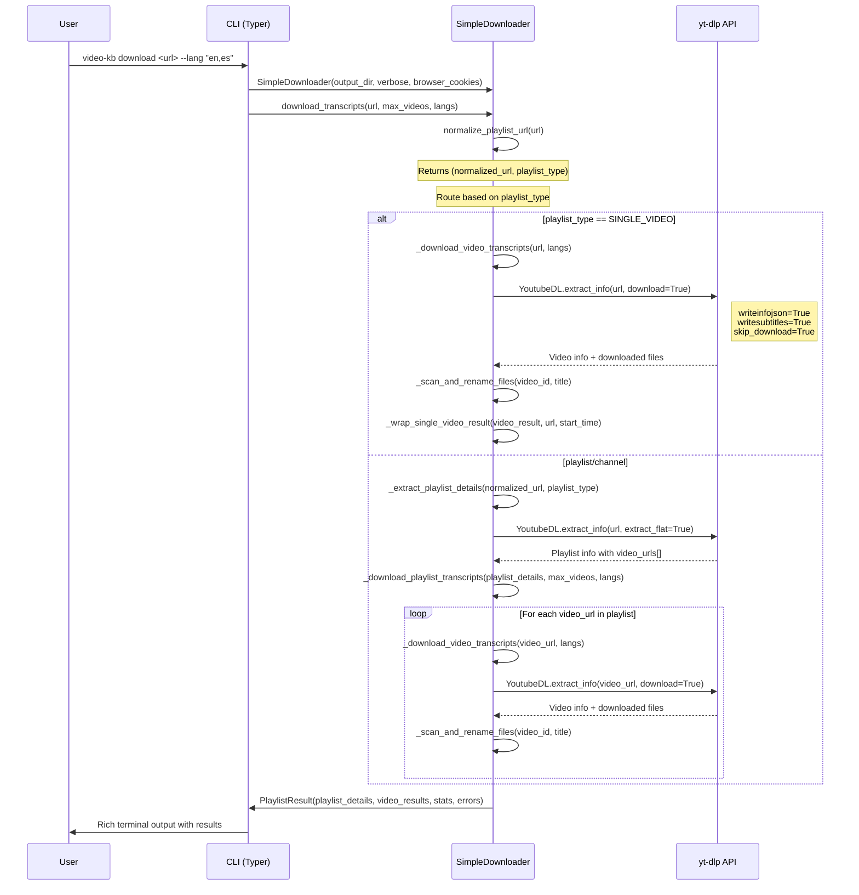

# Video Knowledge Base Simple

A modern CLI tool for bulk transcript extraction from YouTube playlists and channels using yt-dlp.

## Transcript Extraction Flow

The tool uses the `SimpleDownloader` class to extract transcripts with a metadata-first approach and built-in rate limiting:

### Main Processing Flow



### Current Implementation Features

1. **Metadata-First Processing**: Downloads video metadata JSON and subtitles in a single yt-dlp call
2. **Smart File Naming**: Automatically renames files with slugified video titles for readability
3. **Built-in Rate Limiting**: Conservative delays to avoid bot detection:
   - 2s between metadata requests
   - 10s between subtitle downloads
   - 3-30s between video processing
   - 500KB/s bandwidth limit
4. **Error Isolation**: Individual video failures don't stop playlist processing
5. **URL Normalization**: Auto-converts `@channel` to `@channel/videos` format
6. **Browser Cookie Support**: Use `--cookies-from firefox/chrome` for authenticated access

### Future Planned Features

Advanced transcript processing capabilities are planned for future releases:

#### Advanced Transcript Processing (Planned)
1. **Smart Subtitle Classification**: Automatically detect manual vs automatic captions, original vs translated subtitles
2. **Intelligent Language Selection**: Include source languages when downloading auto-translated subtitles (e.g., requesting Polish auto-translated from English automatically includes English source)
3. **Advanced File Naming**: Classified naming convention that identifies subtitle type and source:
   - `video.manual-orig.en.vtt` - Human-created subtitles
   - `video.auto-orig.en.vtt` - Original automatic captions
   - `video.auto-trans-en.pl.vtt` - Auto-translated captions (Polish from English)
4. **Language Availability Filtering**: Only download languages that actually exist for each video, preventing failed requests

#### Enhanced Reliability Features (Planned)
- **Retry logic**: 3 attempts with exponential backoff (30s → 60s → 120s)
- **Extended breaks**: 60-120s pauses every 5 videos to break patterns
- **Impersonation fallback**: Browser impersonation only on final retry attempt
- **Rate limit backoff**: 300-600s delays when receiving HTTP 429 responses

These planned features follow guidelines from the [yt-dlp community](https://github.com/yt-dlp/yt-dlp) for avoiding detection while maintaining reasonable download speeds.

## Features

- 🎥 Bulk transcript extraction from YouTube playlists and channels
- 🧠 **Smart subtitle analysis**: Metadata-first processing to understand subtitle relationships and types
- 📝 **Intelligent classification**: Auto-detects manual vs automatic subtitles, original vs translated content
- 🎯 **Optimized downloads**: Only requests languages that actually exist, includes source languages for translations
- 📂 **Advanced file naming**: Classified filenames that identify subtitle type (`manual-orig`, `auto-trans-en`, etc.)
- 📺 Smart URL handling: auto-converts channels to optimal extraction format
- ⚡ Direct yt-dlp Python API integration (no external binary required)
- 🛡️ Conservative rate limiting with randomized delays and extended breaks
- 🍪 Browser cookie support for authenticated access to private content
- 📊 Rich CLI interface with progress tracking and detailed summaries
- 🔒 Atomic file operations ensuring data integrity during extraction
- 🎯 Type-safe code with full type annotations
- 🚀 Modern Python tooling (uv, ruff, mypy)
- 🧪 Comprehensive test suite

## Installation

### Prerequisites

- Python 3.11 or higher
- [uv](https://github.com/astral-sh/uv) (recommended) or pip

### Install with uv (recommended)

```bash
# Install uv if you haven't already
curl -LsSf https://astral.sh/uv/install.sh | sh

# Clone the repository
git clone <repository-url>
cd video-kb-simple

# Install the package and dependencies
uv sync --extra dev
```

### Install with pip

```bash
# Clone the repository
git clone <repository-url>
cd video-kb-simple

# Create virtual environment
python -m venv .venv
source .venv/bin/activate  # On Windows: .venv\Scripts\activate

# Install the package
pip install -e ".[dev]"
```

## Usage

### Command Overview

```
video-kb [OPTIONS] COMMAND [ARGS]...

Extract transcribed text from videos using yt-dlp

Commands:
  download   Download transcripts from a single video, playlist, or channel.

Options:
  --version                     Show version and exit
  --install-completion          Install completion for the current shell.
  --show-completion             Show completion for the current shell, to copy
                               it or customize the installation.
  --help                        Show this message and exit.
```

#### Download Command
```
video-kb download [OPTIONS] URL

Download transcripts from a single video, playlist, or channel.

Arguments:
  URL  Video, Playlist or Channel URL to download transcripts from [required]

Options:
  --output        -o      PATH     Output directory for transcripts [default: transcripts]
  --cookies-from          TEXT     Extract cookies from browser (firefox, chrome, safari, etc)
  --lang          -l      TEXT     Subtitle languages to download (e.g. 'en', 'es'). Can be
                                   specified multiple times.
  --verbose       -v               Enable verbose output
  --help                           Show this message and exit.
```

### Basic Usage

```bash
# Extract transcript from a single video
video-kb download "https://www.youtube.com/watch?v=dQw4w9WgXcQ"

# Extract transcripts from all videos in a channel (conservative defaults)
video-kb download "https://www.youtube.com/@channelname"

# Extract from a specific playlist
video-kb download "https://www.youtube.com/playlist?list=PLxxxxxx"

# Specify output directory
video-kb download "https://www.youtube.com/@channelname" --output ./my-transcripts

# Enable verbose output
video-kb download "https://www.youtube.com/@channelname" --verbose
```

### Advanced Usage

```bash
# Extract from specific channel tab (videos, shorts, live)
video-kb download "https://www.youtube.com/@channelname/videos"

# Conservative settings with extended delays
video-kb download "https://www.youtube.com/@channelname" \
  --cookies-from firefox \
  --verbose

```

## Development

### Setup Development Environment

```bash
# Install with development dependencies
uv sync --extra dev

# Install pre-commit hooks
uv run --extra dev pre-commit install
```

### Running Tests

```bash
# Run all tests
uv run --extra dev pytest

# Run tests with coverage
uv run --extra dev pytest --cov=video_kb_simple --cov-report=html

# Run specific test file
uv run --extra dev pytest tests/test_cli.py
```

### Code Quality

```bash
# Format code
uv run --extra dev ruff format

# Lint code
uv run --extra dev ruff check

# Type checking
uv run --extra dev mypy video_kb_simple/

# Run all quality checks
uv run --extra dev pre-commit run --all-files
```

### Building and Publishing

```bash
# Build the package
uv build

# Publish to PyPI (configure credentials first)
uv publish
```

## Project Structure

```
video-kb-simple/
├── video_kb_simple/            # Main package
│   ├── __init__.py             # Package initialization
│   ├── __main__.py             # CLI entry point
│   ├── cli.py                  # Typer CLI interface
│   └── downloader.py           # yt-dlp integration
├── tests/                      # Test suite
│   ├── __init__.py
│   ├── test_cli.py
│   └── test_downloader.py
├── pyproject.toml              # Project configuration
├── README.md                   # This file
├── .gitignore                  # Git ignore rules
├── .pre-commit-config.yaml     # Pre-commit hooks
└── CLAUDE.md                   # Development notes
```

## Dependencies

### Runtime Dependencies
- **typer**: Modern CLI framework with rich features
- **yt-dlp[curl-cffi]**: Video/audio downloader and metadata extractor with enhanced HTTP support
- **rich**: Beautiful terminal output
- **pydantic**: Data validation and type safety
- **python-slugify**: Clean URL slug generation for filenames

### Development Dependencies
- **pytest**: Testing framework
- **pytest-cov**: Coverage reporting
- **ruff**: Fast linting and formatting
- **mypy**: Static type checking
- **pre-commit**: Git hooks for code quality

## License

MIT License - see LICENSE file for details.

## Contributing

1. Fork the repository
2. Create a feature branch
3. Make your changes
4. Run tests and quality checks
5. Submit a pull request

## Troubleshooting

### No transcripts available
Some videos may not have subtitles or auto-generated captions available. The tool will skip these videos and continue processing others.

### Rate limiting / Bot detection
If you encounter frequent rate limiting:
- Increase `--min-sleep` and `--max-sleep` values (e.g., `--min-sleep 20 --max-sleep 60`)
- Use browser cookies with `--cookies-from firefox` for authenticated access
- Reduce concurrent processing by running smaller batches

### Permission errors
Make sure you have write permissions to the output directory.

### Incomplete extractions (forced termination)
If the CLI is forcefully terminated (Ctrl+C, kill), you may find:
- **Temporary files**: yt-dlp temporary files that can be safely deleted
- **Complete transcripts**: Files with the format `YYYY-MM-DD_videoId_title.lang.ext` are guaranteed complete due to atomic operations

The tool uses atomic file operations to ensure reliable bulk extraction.
