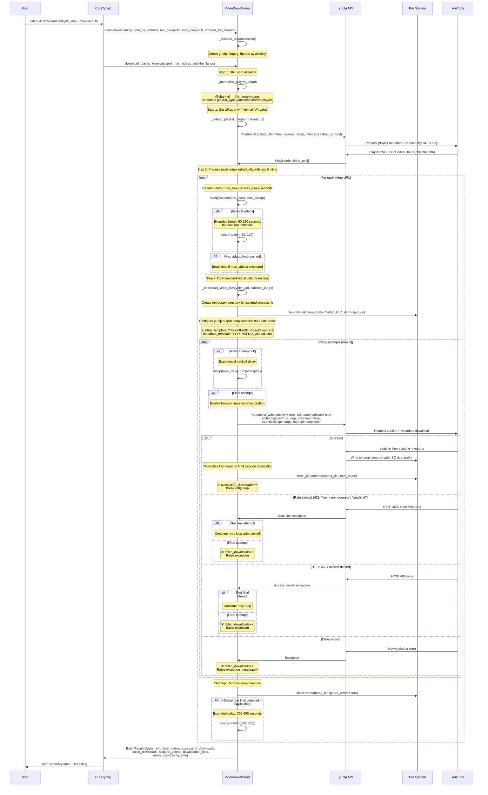

# Video Knowledge Base Simple

A modern CLI tool for bulk transcript extraction from YouTube playlists and channels using yt-dlp.

## Transcript Extraction Flow

The tool processes playlists and channels for bulk transcript extraction with sophisticated bot detection avoidance:



### Playlist/Channel Download Bot Avoidance Features

1. **Two-Step API Optimization**: Step 1: Extract playlist URLs only (`extract_flat=True`), Step 2: Individual video processing
2. **Smart URL Normalization**: Auto-converts `@channel` to `@channel/videos`, detects playlist types
3. **Individual Video Processing**: Each video gets separate metadata + transcript calls for reliability
4. **Conservative Rate Limiting**: Configurable min/max sleep intervals (default 10-30s) between videos
5. **Extended Breaks**: 60-120 second pauses every 5 videos to avoid detection patterns
6. **Aggressive Rate Limit Backoff**: 300-600 second delays (5-10 minutes) when hitting HTTP 429
7. **Atomic Download Archives**: Thread-safe tracking of completed downloads for resume capability
8. **Browser Cookie Support**: `--cookies-from firefox` for authenticated access
9. **Safe Error Handling**: Continue processing remaining videos even if individual downloads fail

## Features

- 🎥 Bulk transcript extraction from YouTube playlists and channels
- 📺 Smart URL handling: auto-converts channels to optimal extraction format
- 📝 High-quality transcript files with ISO date prefixes and slugified titles
- ⚡ Direct yt-dlp Python API integration (no external binary required)
- 🛡️ Conservative rate limiting with randomized delays and extended breaks
- 🍪 Browser cookie support for authenticated access to private content
- 📊 Rich CLI interface with progress tracking and detailed summaries
- 💾 Download archive support for resuming interrupted sessions
- 🔒 Atomic file operations ensuring data integrity during extraction
- 🎯 Type-safe code with full type annotations
- 🚀 Modern Python tooling (uv, ruff, mypy)
- 🧪 Comprehensive test suite

## Installation

### Prerequisites

- Python 3.11 or higher
- [uv](https://github.com/astral-sh/uv) (recommended) or pip

### Install with uv (recommended)

```bash
# Install uv if you haven't already
curl -LsSf https://astral.sh/uv/install.sh | sh

# Clone the repository
git clone <repository-url>
cd video-kb-simple

# Install the package and dependencies
uv sync --extra dev
```

### Install with pip

```bash
# Clone the repository
git clone <repository-url>
cd video-kb-simple

# Create virtual environment
python -m venv .venv
source .venv/bin/activate  # On Windows: .venv\Scripts\activate

# Install the package
pip install -e ".[dev]"
```

## Usage

### Command Overview

```
video-kb [OPTIONS] COMMAND [ARGS]...

Extract transcripts from YouTube playlists and channels using yt-dlp

Commands:
  download         Extract transcripts from all videos in a playlist or channel

Global Options:
  --version        Show version and exit
  --help           Show this message and exit
```

#### Download Command
```
video-kb download [OPTIONS] URL

Arguments:
  URL            Playlist or Channel URL to extract transcripts from [required]

Options:
  -o, --output PATH              Output directory for transcripts [default: ./transcripts]
  --min-sleep INTEGER            Minimum seconds to sleep between downloads [default: 10]
  --max-sleep INTEGER            Maximum seconds to sleep between downloads [default: 30]
  --cookies-from TEXT            Extract cookies from browser (firefox, chrome, safari, etc)
  --download-archive PATH        Path to download archive file (tracks completed downloads)
  -v, --verbose                  Enable verbose output
```

### Basic Usage

```bash
# Extract transcripts from all videos in a channel (conservative defaults)
video-kb download "https://www.youtube.com/@channelname"

# Extract from a specific playlist
video-kb download "https://www.youtube.com/playlist?list=PLxxxxxx"

# Specify output directory
video-kb download "https://www.youtube.com/@channelname" --output ./my-transcripts

# Enable verbose output
video-kb download "https://www.youtube.com/@channelname" --verbose
```

### Advanced Usage

```bash
# Extract from specific channel tab (videos, shorts, live)
video-kb download "https://www.youtube.com/@channelname/videos"

# Conservative settings with extended delays
video-kb download "https://www.youtube.com/@channelname" \
  --min-sleep 15 \
  --max-sleep 45 \
  --cookies-from firefox \
  --download-archive ./my_downloads.txt \
  --verbose

# Resume interrupted downloads using archive
video-kb download "https://www.youtube.com/@channelname" \
  --download-archive ./my_downloads.txt
```

## Development

### Setup Development Environment

```bash
# Install with development dependencies
uv sync --extra dev

# Install pre-commit hooks
uv run --extra dev pre-commit install
```

### Running Tests

```bash
# Run all tests
uv run --extra dev pytest

# Run tests with coverage
uv run --extra dev pytest --cov=video_kb_simple --cov-report=html

# Run specific test file
uv run --extra dev pytest tests/test_cli.py
```

### Code Quality

```bash
# Format code
uv run --extra dev ruff format

# Lint code
uv run --extra dev ruff check

# Type checking
uv run --extra dev mypy video_kb_simple/

# Run all quality checks
uv run --extra dev pre-commit run --all-files
```

### Building and Publishing

```bash
# Build the package
uv build

# Publish to PyPI (configure credentials first)
uv publish
```

## Project Structure

```
video-kb-simple/
├── video_kb_simple/          # Main package
│   ├── __init__.py           # Package initialization
│   ├── __main__.py           # CLI entry point
│   ├── cli.py                # Typer CLI interface
│   └── downloader.py         # yt-dlp integration
├── tests/                    # Test suite
│   ├── __init__.py
│   ├── test_cli.py
│   └── test_downloader.py
├── pyproject.toml            # Project configuration
├── README.md                 # This file
├── .gitignore               # Git ignore rules
├── .pre-commit-config.yaml  # Pre-commit hooks
└── CLAUDE.md                # Development notes
```

## Dependencies

### Runtime Dependencies
- **typer[all]**: Modern CLI framework with rich features
- **yt-dlp**: Video/audio downloader and metadata extractor
- **rich**: Beautiful terminal output
- **pydantic**: Data validation and type safety

### Development Dependencies
- **pytest**: Testing framework
- **pytest-cov**: Coverage reporting
- **ruff**: Fast linting and formatting
- **mypy**: Static type checking
- **pre-commit**: Git hooks for code quality

## License

MIT License - see LICENSE file for details.

## Contributing

1. Fork the repository
2. Create a feature branch
3. Make your changes
4. Run tests and quality checks
5. Submit a pull request

## Troubleshooting

### No transcripts available
Some videos may not have subtitles or auto-generated captions available. The tool will skip these videos and continue processing others.

### Rate limiting / Bot detection
If you encounter frequent rate limiting:
- Increase `--min-sleep` and `--max-sleep` values (e.g., `--min-sleep 20 --max-sleep 60`)
- Use browser cookies with `--cookies-from firefox` for authenticated access
- Reduce concurrent processing by running smaller batches

### Permission errors
Make sure you have write permissions to the output directory and download archive file.

### Incomplete extractions (forced termination)
If the CLI is forcefully terminated (Ctrl+C, kill), you may find:
- **Temporary files**: yt-dlp temporary files that can be safely deleted
- **Complete transcripts**: Files with the format `YYYY-MM-DD_videoId_title.lang.ext` are guaranteed complete due to atomic operations
- **Download archive**: Use `--download-archive` to resume from where you left off

The tool uses atomic file operations and download archives to ensure resumable and reliable bulk extraction.
